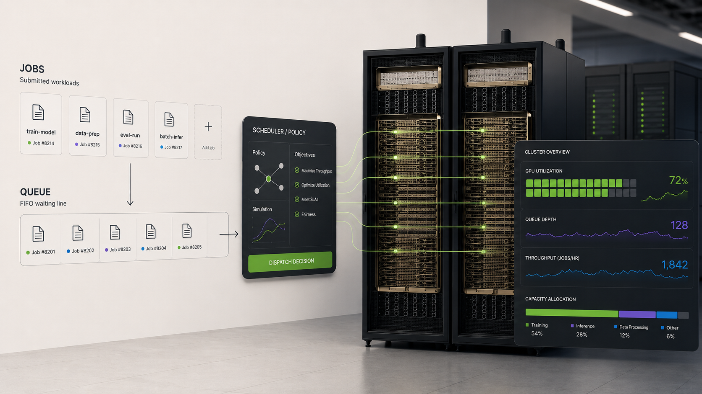
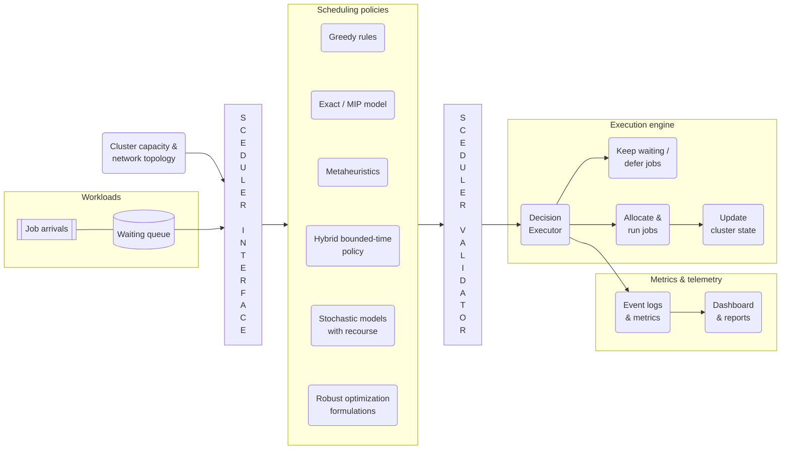
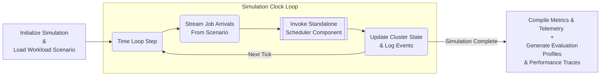

# Compute Capacity Orchestrator

**Optimization and simulation for GPU workload scheduling**

[Live Demo](https://capacity-orchestrator.onrender.com)



Compute Capacity Orchestrator (CCO) is a public research and engineering project for studying how scarce GPU capacity should be allocated when jobs arrive over time, wait in queues, and compete for limited accelerator resources.

The project models a realistic scheduling setting: some jobs need one GPU, some need a group of GPUs to start together, and different workload classes have different priorities, deadlines, and runtime uncertainty. It compares fast scheduling rules, mathematical optimization models, and hybrid policies that must return decisions within a practical time budget.

The goal is to make the central tradeoff visible: keep expensive accelerators busy while avoiding queue growth, capacity fragmentation, delayed high-priority work, and slow scheduler decisions.

## Core Thesis

CCO is a production-oriented scheduling framework developed in a controlled simulation environment before integration with real cluster telemetry and execution systems. The problem it addresses is a dynamic decision problem under scarcity and uncertainty.

At each decision point in time, the scheduler must choose which jobs start now, which jobs wait, and where running jobs should be placed. Those choices affect more than short-term utilization. They affect queue growth, wait time, deadline risk, cluster fragmentation, and the ability to run large jobs that need many GPUs at once. Placement also matters: two schedules with the same number of GPUs can behave very differently if one keeps related GPUs close together and the other spreads them across a weaker part of the cluster fabric.

A simple rule can make fast decisions, but it may waste capacity structure. An exact optimization model can produce better schedules on small instances, but it may become too slow as the problem grows. A practical scheduler has to balance decision quality against decision time.

This project studies that tradeoff directly by combining scheduling models, queue simulation, topology-aware placement, and policy evaluation in one system.

## Why This Matters

Scarce compute is more than an engineering detail, it is a business constraint. Whether the setting is AI training, inference serving, cloud capacity, robotics simulation, evaluation pipelines, or internal research workloads, poor scheduling turns expensive infrastructure into waiting time, missed deadlines, fragmented capacity, and lost throughput.
At AI-infrastructure scale, the same problem becomes a performance-modeling question: how should scarce accelerator capacity be scheduled when solver latency, GPU locality, interconnect structure, and scale-up versus scale-out choices all affect throughput and service risk?
CCO is built to quantify these structural tradeoffs before changing a real system:

* **Infrastructure operations:** improve utilization without creating fragmentation that blocks large jobs.
* **Platform engineering:** balance short latency-sensitive jobs against long-running training, evaluation, or simulation workloads.
* **Capacity planning:** test sudden demand spikes, unexpected node failures, quota policies, and cloud-burst options before deployment.
* **Operations research:** compare fast heuristics, metaheuristics, exact optimization, and hybrid methods under the same simulation harness.
* **Leadership and finance:** connect scheduling policy to measurable outcomes such as throughput, wait time, service risk, and infrastructure efficiency.

A static optimization model is not enough by itself. To understand its actual production impact, a scheduling policy must be evaluated continuously inside a queueing system under variable demand pressure, strict solver latency budgets, and complex placement constraints.

## How the System Works

CCO strictly separates the standalone scheduling core from the discrete-time simulation loop.
The scheduling core operates as a pure decision engine. It receives a snapshot of the current system: waiting jobs, running jobs, available cluster capacity, and topology constraints. Then, it returns a deterministic allocation plan: which jobs should start now, where they should run, and which jobs should remain queued.

The structural execution path of this standalone scheduler component is mapped out in the flowchart below:





Before a scheduling decision is applied, CCO validates it against the snapshot that produced it. The validator checks that all referenced jobs and nodes exist, every queued job is accounted for, started jobs receive their full GPU demand, and node capacity is not exceeded. A validated decision is then passed to the decision executor, which updates queue and cluster state and emits events for the metrics layer.

The simulation loop provides the temporal environment to stress-test these scheduling policies. It loads a static workload scenario, manages the clock ticks, streams upcoming job arrivals into the waiting queue, and invokes the standalone scheduler. The simulator then updates the living cluster state based on the scheduler's choices and writes out execution history. This isolation guarantees that policies are thoroughly evaluated before integration with real-time cluster telemetry.
The internal clock loop and data mutations managed by the simulation engine are trace-mapped in the timeline diagram below:



The repository layout is organized around five isolated layers:

* Workload Generation: creates reproducible job streams, cluster hardware structures, and historical demand scenarios.
* Scheduling Core: exposes a unified interface for pluggable greedy rules, exact optimization models, metaheuristics, and hybrid bounded-time policies, multi-stage stochastic formulations with recourse, and robust optimization models.
* Decision Validation and State Management: validates proposed scheduling decisions, applies accepted decisions, starts jobs, keeps waiting jobs queued, releases completed work, and updates cluster state.
* Simulation Loop: advances time and repeatedly calls the scheduler to evaluate policy behavior under controlled conditions.
* Metrics Layer: measures utilization, queue length, wait time, deadline risk, placement quality, scheduler runtime, and value captured.

## 5. Mathematical Starting Point

The first model is a single-decision scheduling snapshot. At the current scheduling time $t_0$, the scheduler observes the eligible waiting jobs and the currently available GPU capacity. It chooses which jobs start now and how many GPUs each selected job receives from each node.

### Sets

$$
\begin{aligned}  
J &= \text{set of eligible queued jobs}, \\  
N &= \text{set of available cluster nodes}.  
\end{aligned}
$$

### Parameters

For each job $j \in J$:

$$
\begin{aligned}  
g_j &= \text{number of GPUs required by job } j, \\  
d_j &= \text{duration of job } j, \\  
p_j &= \text{priority or value of job } j, \\  
\ell_j &= \text{deadline of job } j.  
\end{aligned}
$$

For each node $i \in N$:

$$
c_i = \text{number of currently available GPUs on node } i.
$$

The current scheduling time is $t_0$.

### Derived Parameters

If job $j$ starts now, its lateness is known before optimization:

$$
L_j = \max (0; t_0 + d_j - \ell_j).
$$

The deadline penalty is:

$$
q_j = \beta L_j,
$$

where $\beta \ge 0$ controls how strongly late completion is penalized. When $\beta = 0$, deadline penalties are disabled.

### Decision Variables

$$
\begin{aligned}  
x_{ij} &\in \mathbb{Z}_+  
&& \text{number of GPUs from node } i \text{ assigned to job } j, \\  
y_j &\in \\{0,1\\}  
&& \text{1 if job } j \text{ starts now, 0 otherwise.}  
\end{aligned}
$$

### Model

$$
\begin{aligned} 
\max \quad & \sum_{j \in J} (p_j - q_j)y_j \\\\[4pt] 
\text{s.t.} \quad & \sum_{i \in N} x_{ij} = g_j y_j && \forall j \in J, \\\\[4pt] 
& \sum_{j \in J} x_{ij} \le c_i && \forall i \in N, \\\\[4pt] 
& x_{ij} \in \mathbb{Z}_+ && \forall i \in N, j \in J, \\\\[4pt] 
& y_j \in \\{0,1\\} && \forall j \in J. 
\end{aligned}
$$


The first constraint enforces all-or-nothing GPU allocation: a job that starts must receive its full GPU demand, while a job that does not start receives no GPUs. The second constraint ensures that the total number of GPUs allocated from any node does not exceed that node’s currently available GPU capacity.

This draft is not yet a full time-indexed scheduling model. It is the smallest clean model needed to define the core allocation decision. Later versions extend the same structure to a planning horizon, topology-aware placement(NVLink vs. InfiniBand hops), GPU types, stochastic scenarios, and decomposition methods.

## 6. Scheduling Policies

CCO evaluates scheduling policies across a staged progression of complexity:

* **Greedy baseline:** fast deterministic rules such as shortest processing time, earliest deadline, priority order, or value density. These policies are easy to explain, cheap to run, and useful as both baselines and fallbacks.
* **Metaheuristics:** local-search methods such as tabu search, simulated annealing, or large-neighborhood search. These methods can improve placement quality without requiring a full exact solve at every decision point.
* **Exact optimization model:** MIP-based formulations used as reference models on small and medium instances. These models clarify the structure of the scheduling problem and provide high-quality solutions when runtime is acceptable.
* **Hybrid bounded-time scheduler:** a production-oriented policy that runs a stronger method under a strict time budget and falls back to a fast heuristic when the stronger method is too slow or fails to return a useful solution.

The goal is not to favor one method in isolation. The goal is to compare decision quality, scheduler runtime, queue behavior, and operational impact under the same evaluation harness.

## 7. Project Roadmap

* **Phase 1 - Core harness:** schemas, queue state, cluster state, baseline scheduling rules, exact snapshot optimization, validation, metrics, tests, and a runnable dashboard.
* **Phase 2 - Exact optimization:** snapshot and time-indexed MIP formulations, rolling-horizon scheduling, GPU capacity constraints, release-time constraints, deadline penalties, and reference solver integrations.
* **Phase 3 - Hybrid scheduling:** bounded runtime, fallback policies, solver-status handling, and comparison of solution quality against scheduler latency.
* **Phase 4 - Topology and workload realism:** GPU types, H100-class accelerator pools, NVLink domains, node groups, rack locality, InfiniBand/Ethernet fabric effects, multi-node placement, topology penalties, and workload classes such as inference, evaluation, simulation, and training.
* **Phase 5 - Policy laboratory:** stochastic demand scenarios, capacity drops, quota policies, cloud-burst options, and dashboard-based policy comparison.
* **Phase 6 - Advanced optimization research:** column generation for large placement-pattern models and Benders-style decomposition for planning, recourse, and feasibility separation.

## 8. Current Implementation Status

**Current phase:** Phase 1 - Core Scheduling Harness

The current release establishes the core scheduling and simulation harness. It includes stable data contracts, a scheduler interface, decision validation, baseline and exact snapshot schedulers, state updates, metrics, tests, and a Streamlit dashboard for inspecting snapshot and simulation experiments.

**Implemented:**

* Strict type-hinted schemas for jobs, resources, topology, scheduling snapshots, and scheduling decisions.
* Deterministic workload and cluster scenario generation.
* Heavy-tailed synthetic arrival generation for simulation experiments.
* Greedy snapshot scheduler.
* Exact snapshot MIP scheduler using Pyomo/HiGHS.
* Decision validation against snapshot feasibility.
* State update logic for waiting, running, and completed jobs.
* Closed-loop simulation with arrivals, scheduling decisions, job completion, and GPU release.
* Metrics for utilization, queue length, wait time, deadline risk, objective value, and scheduler runtime.
* Streamlit dashboard with snapshot and simulation views.
* Regression tests for schemas, engines, validation, metrics, scenarios, simulation, and dashboard data builders.

**Planned next:**

* Time-indexed MIP formulation over a short planning horizon.
* Rolling-horizon scheduler for anticipatory capacity allocation.
* Hybrid bounded-time scheduling with fallback behavior.
* Topology-aware placement using node groups, GPU types, and locality penalties.
* Stochastic demand scenarios, capacity shocks, quota policies, and cloud-burst options.
* Decomposition-based solver experiments for larger planning and placement models.

## 9. Repository Layout

```test
compute-capacity-orchestrator/
├── app/                         # Streamlit dashboard entry point and page views
├── docs/                        # Architecture, formulation, roadmap, and terminology notes
├── notebooks/                   # Optional exploratory notebooks
├── scripts/                     # Command-line demos and experiment runners
├── src/
│   └── compute_capacity_orchestrator/
│       ├── engines/             # Scheduler interfaces, greedy policy, exact MIP, validation
│       ├── experiments/         # Reproducible snapshot and simulation scenarios
│       ├── metrics/             # Utilization, queueing, value, and decision metrics
│       ├── schemas/             # Jobs, resources, topology, snapshots, and decisions
│       ├── simulation/          # State evolution, arrivals, and simulation loop
│       └── visualization/       # Plotting utilities
└── tests/                       # Unit and Regression tests organized by project layer
```
