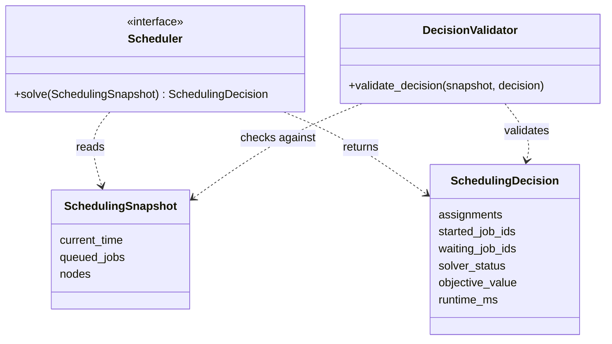

# Architecture

## 1. Architectural Intent

Compute Capacity Orchestrator (CCO) separates the scheduling core from the simulation environment and from the Streamlit dashboard.

The scheduler is treated as a pure decision engine: it receives the current system state, proposes a scheduling decision, and does not own the simulation clock, job arrivals, job completion, GPU release, or dashboard rendering.

This separation keeps policies interchangeable and allows the same scheduler interface to support greedy rules, exact MIP models, rolling-horizon policies, and future decomposition-based methods.

## 2. System Boundary

CCO is currently a scheduling and simulation system, not a production cluster manager.

Within the current system boundary, CCO owns the data contracts, scheduling engines, feasibility validation, simulation state transitions, synthetic workload generation, metrics, and dashboard inspection.

Outside the current system boundary are live cluster telemetry, Kubernetes or Slurm execution, real job submission systems, cloud provisioning, authentication, multi-user service concerns, and production incident response.

The current simulator acts as a controlled substitute for a real cluster environment. A future production integration would replace synthetic arrivals and simulated state transitions with real telemetry and execution events, while preserving the same scheduling contract:


| Area             | Current implementation                     | Future production integration                    |
| ------------------ | -------------------------------------------- | -------------------------------------------------- |
| Workload input   | Synthetic scenarios and generated arrivals | Real job queue or platform API                   |
| Capacity state   | Simulated node capacity                    | Live cluster telemetry                           |
| Scheduler output | Validated scheduling decision              | Dispatch plan for an executor                    |
| Execution        | Simulated state transition                 | Kubernetes, Slurm, Ray, or internal orchestrator |
| Metrics          | Experiment and dashboard metrics           | Production telemetry and service-level reporting |

## 3. Core Decision Contract

The central contract is:

```text
SchedulingSnapshot -> Scheduler -> SchedulingDecision
```

A SchedulingSnapshot contains the current time, eligible queued jobs, and available cluster nodes. A SchedulingDecision contains GPU assignments, started job IDs, waiting job IDs, solver status, objective value, and scheduler runtime.

Before a decision is applied, the validator checks that all referenced jobs and nodes exist, every queued job is either started or waiting, started jobs receive their full GPU demand, assignments do not exceed node capacity, and assignments only reference jobs marked as started.



Scheduler implementations may differ internally, but every policy must return a feasible decision under the same external contract.

## 4. Runtime Modes

CCO has two runtime modes.

### Snapshot mode

Snapshot mode evaluates one scheduling decision. A fixed set of queued jobs and available nodes is passed to a scheduler. The scheduler returns started jobs, waiting jobs, and GPU assignments. The decision is validated and summarized with metrics.

### Simulation mode

Simulation mode evaluates a policy over time. At each step, the simulation loop releases completed jobs, admits new arrivals, builds a scheduling snapshot, invokes the scheduler, validates and applies the decision, and records step-level metrics.

Schedulers do not mutate simulation state directly. They only propose decisions. This keeps policy evaluation reproducible and makes it possible to compare greedy, exact, hybrid, and future rolling-horizon schedulers under the same simulation harness.

## 5. Layer Responsibilities


| Layer          | Responsibility                                                                                                                                       |
| ---------------- | ------------------------------------------------------------------------------------------------------------------------------------------------------ |
| `schemas/`     | Defines typed contracts for jobs, resources, topology, snapshots, assignments, and scheduler decisions.                                              |
| `engines/`     | Implements scheduler interfaces, greedy scheduling, exact snapshot optimization, hybrid hooks, and decision validation.                              |
| `experiments/` | Provides reproducible scenarios for demos, tests, and dashboard runs.                                                                                |
| `metrics/`     | Computes decision quality, utilization, queueing behavior, value captured, deadline risk, and scheduler runtime.                                     |
| `simulation/`  | Evolves system state over time by admitting arrivals, invoking schedulers, applying decisions, releasing completed jobs, and recording step metrics. |
| `app/`         | Presents snapshot and simulation experiments through Streamlit without owning the core scheduling logic.                                             |

## 6. Testing Strategy

The test suite mirrors the architecture layers.

Schema tests protect the data contracts. Engine tests check scheduler behavior. Validation tests ensure that scheduler decisions are feasible before they are applied. Simulation tests cover state transitions, arrivals, completions, and GPU release. Metrics tests verify utilization, queueing, value, deadline, and runtime calculations. App tests focus on dashboard data builders rather than fragile Streamlit rendering.

This testing structure keeps the Streamlit dashboard thin. The core scheduling and simulation behavior can be tested without launching the UI.

## 7. Extension Points

The architecture is prepared for several future layers.


| Extension                         | Architectural hook                                                                              |
| ----------------------------------- | ------------------------------------------------------------------------------------------------- |
| Time-indexed MIP                  | Add a scheduler that solves over a short planning horizon.                                      |
| Rolling-horizon control           | Reuse the simulation loop and call a planning scheduler at each time step.                      |
| Topology-aware placement          | Extend node, topology, and assignment costs without changing the scheduler interface.           |
| Stochastic scenarios              | Generate multiple future arrival paths and evaluate policies under scenario stress.             |
| Hybrid bounded-time scheduling    | Wrap stronger optimizers with timeout, gap, and fallback behavior.                              |
| Decomposition / column generation | Replace monolithic optimization internals while preserving the same external decision contract. |

## 8. Repository Organization

The repository follows a layered structure. The Streamlit app is intentionally separated from the scheduling and simulation core so the core logic can be tested without the dashboard.

```text
compute-capacity-orchestrator/
├── app/
│   ├── streamlit_app.py
│   └── views/
│       ├── snapshot_view.py
│       ├── snapshot_components.py
│       ├── simulation_view.py
│       ├── simulation_components.py
│       ├── time_indexed_page.py
│       └── offline_page.py
│
├── docs/
│   ├── architecture.md
│   ├── formulation.md
│   ├── roadmap.md
│   └── terminology.md
│
├── scripts/
│   ├── run_snapshot_greedy_demo.py
│   ├── run_snapshot_pyomo_demo.py
│   ├── run_snapshot_scale_demo.py
│   └── run_simulation_demo.py
│
├── src/
│   └── compute_capacity_orchestrator/
│       ├── schemas/
│       ├── engines/
│       ├── experiments/
│       ├── metrics/
│       ├── simulation/
│       └── visualization/
│
└── tests/
    ├── app/
    ├── engines/
    ├── experiments/
    ├── metrics/
    ├── schemas/
    └── simulation/
```
